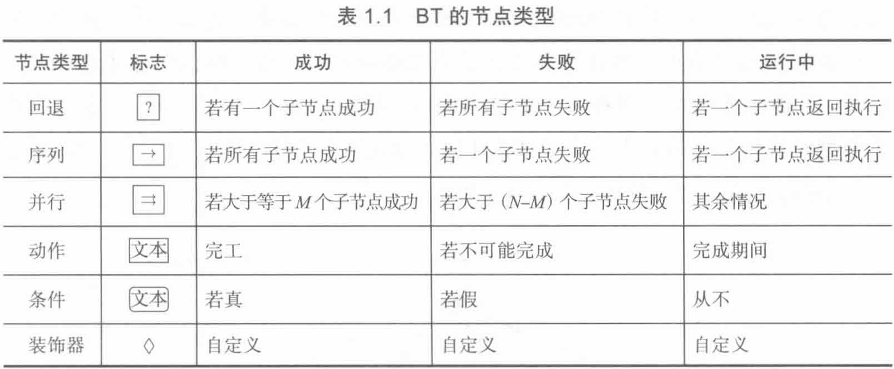

# 机器人学和人工智能中的行为树

- 本书附带网址 https://btirai.github.io/
- C++库 https://github.com/BehaviorTree/BehaviorTree.CPP
- ROS库 https://wiki.ros.org/behavior_tree
- Python库 https://github.com/futureneer/beetree

### 1.3 BT经典阐述

BT是创建具有**模块化**和**反应性**复杂系统的一种有效方式。BT是一种有向的根树，根是没有父节点的节点，树中的内部节点称为控制流节点，控制流节点至少又一个子节点。

BT从生成给定频率的时钟信号的根节点开始执行。这些信号允许执行一个节点，并传递给选中节点的一个或多个子节点。当且仅当节点接受到时钟信号时才会执行该节点。如果子节点正在执行中，则立刻将“执行”返回到父节点，如果子节点已经实现执行目标，则立刻返回成功，否则返回失败。

存在四类控制流节点(序列，回退，并行和装饰器)和两类执行节点(动作和条件)。

每个节点的具体讲解 __请看书__ 

1.3.2 带有内存的控制流节点 __请看书 __ 

### 7.2 使用行为语言进行规划

从P123开始  __请看书 __  

### 第 八、九、十 章 不看
